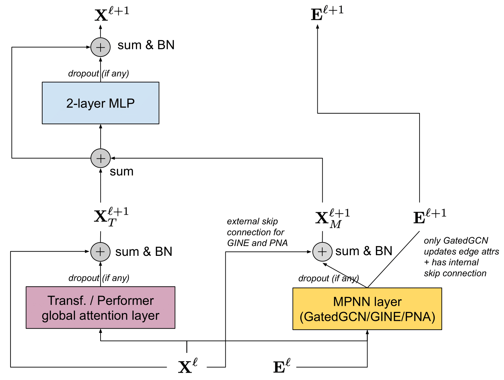

# Graph Transformers

## GPS Layer and GraphGPS Model

GPS layer is combined with **local MPNN** (to capture locality bias) and **global Trnasformer**, and folled by 2-layer MLP and skip connections.



### Loacal MPNN

$$ \hat{X}_M^{l + 1}, E^{l + 1} = MPNN_e^l(X^l, E^l, A) $$

$$ X_M^{l + 1} = BatchNorm(Dropout(\hat{X}_M^{l + 1}) + X^l) $$

```python
h = self.conv(x, edge_index, **kwargs)
h = F.dropout(h, p=self.dropout, training=self.training)
h = h + x
if self.norm1 is not None:
    if self.norm_with_batch:
        h = self.norm1(h, batch=batch)
    else:
        h = self.norm1(h)
hs.append(h)
```

### Global Attention

$$ \hat{X}_T^{l + 1} = GlobalAttn^l(X^l) $$

$$ X_T^{l + 1} = BatchNorm(Dropout(\hat{X}_T^{l + 1}) + X^l) $$

```python
h, mask = to_dense_batch(x, batch)

if isinstance(self.attn, torch.nn.MultiheadAttention):
    h, _ = self.attn(h, h, h, key_padding_mask=~mask, need_weights=False)
elif isinstance(self.attn, PerformerAttention):
    h = self.attn(h, mask=mask)

h = h[mask]
h = F.dropout(h, p=self.dropout, training=self.training)
h = h + x  # Residual connection.
if self.norm2 is not None:
    if self.norm_with_batch:
        h = self.norm2(h, batch=batch)
    else:
        h = self.norm2(h)
hs.append(h)
```

### Combine local and global outputs

$$ X^{l + 1} = MLP(X_M^{l + 1} + X_T^{l + 1}) $$

```python
out = sum(hs)

out = out + self.mlp(out)
if self.norm3 is not None:
    if self.norm_with_batch:
        out = self.norm3(out, batch=batch)
    else:
        out = self.norm3(out)
```

The difference between GraphGPS and GraphTrans is that, in GraphTrans, a few layers are comparised before the Transformer, which may be limited by problems of over-smoothing, over-squashing and low expressivity aginst the WL test.

The design of GPS is a stacking of MPNN and transformers hybrid, which resolves the local expressivity bottlenecks by allowing information to spread across the graph via full-connectivity.

### Train GraphGPS on graph-structured data

